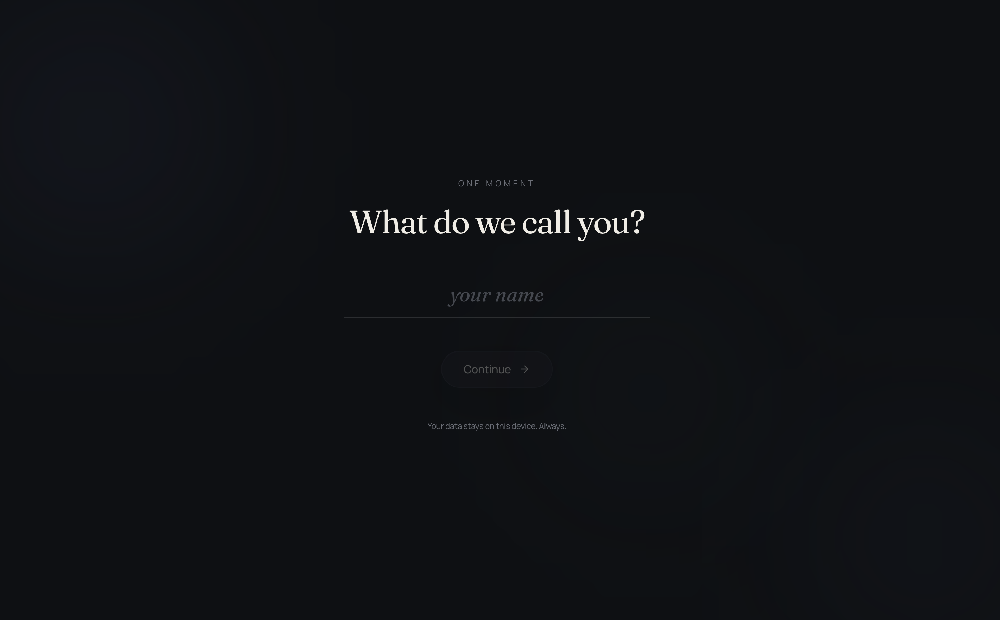
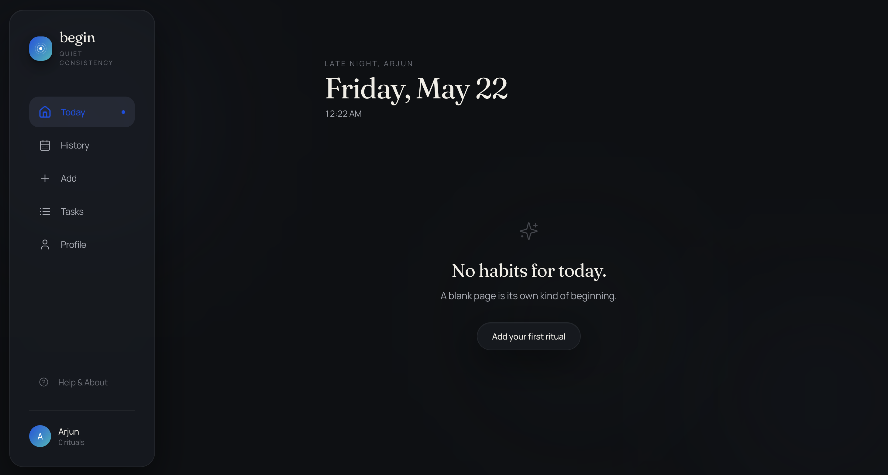
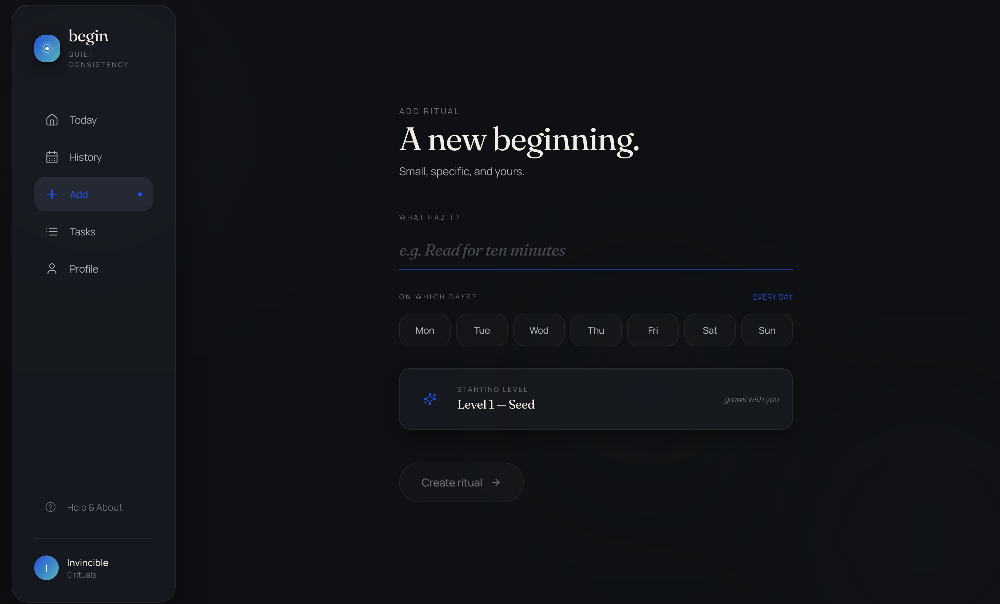

# Begin

A calm, minimalist microhabit tracker focused on consistency, not pressure.

🌐 Live App: https://begin-app.netlify.app/

No streaks.  
No notifications.  
No gamification.  
No ads.

Just small habits that quietly grow over time.

This app is created with a goal of being OPEN and every decision of the architecture has been taken by keeping PRIVACY in mind.
---

## Philosophy

Begin is built around a simple idea:

> Tiny actions repeated consistently become part of who you are.

The app is intentionally designed to avoid:
- streak anxiety
- productivity pressure
- endless optimization
- engagement addiction

Instead, habits evolve gradually through consistency and time.

---

## Features

- Minimal and clean UI
- Microhabit-focused
- Offline-first
- No account required
- Per-habit growth states
- AI-assisted habit upgrades
- Local data storage
- Open source
- Web support
- iOS and Android apps coming soon

---

## Habit Growth System

Habits move through natural maturity states:

- Seed
- Sprout
- Root
- Flow
- Anchor

Growth is based on:
- consistency
- stability
- time

Not intensity.

A habit can remain tiny forever and still mature.

---

## Screenshots

> Screenshots are located in `app/web/screenshots`

### Onboarding



### Home



### Create Habit



---

## Monorepo Structure

```txt
app/
├── web/
├── ios/        (coming soon)
├── android/    (coming soon)
└── shared/
```

---

## Tech Stack

Current:
- Web app (Next JS, Typescript, Tailwind)

Planned:
- iOS app
- Android app

Architecture goals:
- local-first
- lightweight
- fast
- maintainable
- minimal dependencies

---

## Principles

Begin intentionally avoids:
- streak systems
- leaderboards
- achievement badges
- social pressure
- aggressive reminders
- ads and engagement tricks

The goal is to create a calm experience that respects the user's attention.

---

## Open Source

This project is open source and built in public.

Contributions, ideas, and discussions are welcome.

---

## Future Plans

- Native mobile apps
- Widgets
- Local AI habit suggestions
- Data export/import
- Optional cloud sync
- Theming

---

## License

MIT